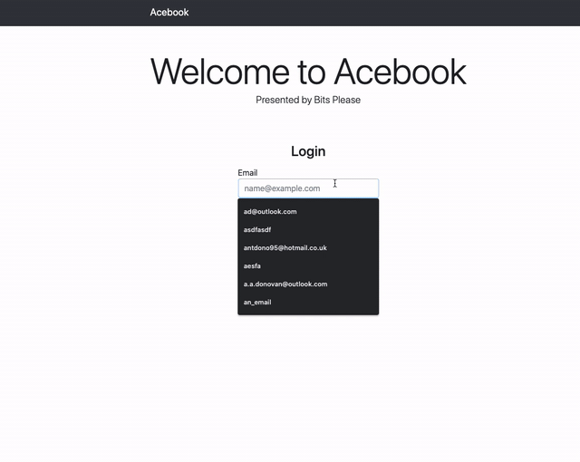

<div align="center">

<br><br>

 [](https://codeclimate.com/github/ad13380/acebook-bits-please/maintainability) [](https://codeclimate.com/github/ad13380/acebook-bits-please/test_coverage)

[Features](#features) | [Team Acebook](#team-acebook) | [Technologies](#technologies) | [Setup](#setup) | [Future Modifications](#future-Modifications)

### _This project was originally deployed on Heroku, but was later taken down due to ongoing monthly charges_

</div>

A fullstack social media clone, demonstrating the majority of the core functionality of Facebook. Developed using Ruby on Rails with a PostgreSQL database, this application allows users to sign up, set up a profile, upload photos, make posts and comments, and edit or delete their posts, comments or photos at a later point. The timeframe for this project was 2 weeks.

## Features

### Signing up, Logging in and Logging out



```
As a user
So that I can connect to other people during this pandemic
I would like to sign up to a new social network
```

```
As a user
So that I can start using Acebook
I would like to be able to sign in
```

```
As a user
For security reasons, after I finished using the app
I would like to be able to sign out
```

```
As system designer
So that I can offer an improved user experience
I would like to collect user's first and last name on sign up
```

```
As system designer
So that I can offer high level of security
Users will have to provide an email address with a correct format
```

```
As system designer
So that I can ensure higher level of security for users
Users will have to provide a password of between 6 and 10 characters
```

```
As a system designer
to ensure security and a good user experience
Any non signed in user cannot visit any page other than the home page
```

### Creating, Editing and Deleting a Post


```
As a user
So that I can start sharing my thoughts and feelings
I would like to be able to add a new post
```

```
As a user
If I change my mind about what I would like to share
I would like to be able to delete a post
```

```
As a user
If I make a mistake or would like to add or change what I say
I would like to be able to edit a post
```

```
As a user
So that I can see when a post was created
I would like to visualise every post with the date it was created
```

```
As a system designer
So that a specific comment's subject matter cannot be changed after a certain time
Users are only able to edit their posts within 10 minutes from their creation
```

### Creating, Editing and Deleting a Comment


```
As a user
So that I can tell people how I feel about their post
I would like to be able to comment on them
```

```
As a user
If I change my mind about what I would like to share
I would like to be able to delete my own comment
```

```
As a user
If I make a mistake or want to remove my post
I would like to be able to edit my own comments
```

```
As a user
So that the poster knows who has commented
I would like my name to be detailed above my comment
```

### Creating a profile, Uploading a photo album


```
As a user
So that I can share my life with the world
I would like to be able to upload photos into albums
```

```
As a user
So that I can personalise my profile
I would like to be able to set a photo from one of my albums as my profile picture
```

### Interacting with another user's content


```
As a system designer
To ensure that the service is fair and secure
Users are only able to edit and delete their own posts
```

```
As a system designer
To ensure that the service is fair and secure
Users are only able to edit and delete their own comments
```

```
As a system designer
To ensure that the service is fair and secure
Users are only able to edit and delete their own photos
```

## Team Acebook

Our wonderful team is made up of:

- [Anthony Donovan](https://github.com/ad13380)
- [Alastair Sumner](https://github.com/Sumner1185)
- [Benedetta Arinci](https://github.com/BeneArinci)
- [Katie McDonagh](https://github.com/Katie-McDonagh)

## Technologies

| Area                 | Technology                 |
| -------------------- | -------------------------- |
| Frameworks           | Ruby on Rails              |
| Languages            | Ruby, HTML5, CSS3          |
| Database and Storage | PostgreSQL, ActiveStorage  |
| CI/CD                | Travis                     |
| Hosting              | Heroku                     |
| Testing and Coverage | RSpec, Capybara, Simplecov |

## Setup

### Database dependencies

In order to run this application, you would need to have `PostgreSQL` installed. To install postgresQL via `Homebrew`, you can run the following commands:

```
$ brew install postgresql
$ brew services start postgresql
$ psql postgres
```

### Environment

First clone this repository, then run:

```
$ bundle install
$ bin/rails db:create
$ bin/rails db:migrate
$ bin/rails db:migrate RAILS_ENV=test
```

To run the application, run:

```
$ bin/rails server
```

To run tests, run:

```
$ bundle exec rspec
```

## Future Modifications

In the limited time we had to complete the project we managed to implement 4 core features (posts, comments, profiles and photo albums). If we had some more time we would like to add the following features to our application.

    * Users can like other users' photos, posts and comments
    * Users can comment on users' photos
    * User's profile picture is shown by their name on all pages
    * Add friend requests
    * Album's are shown by thumbnails with cover photos
    * More time to spend on styling
